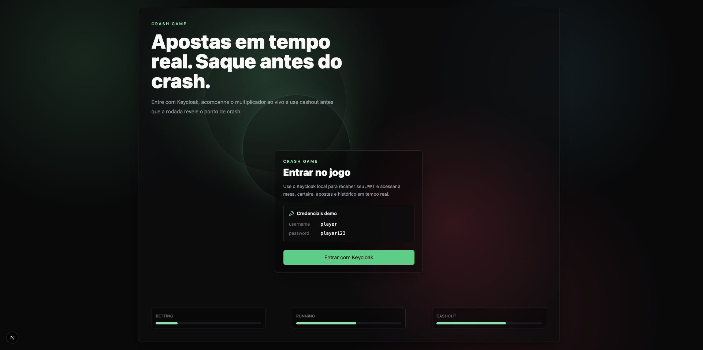

<h1 align="center">
  <span>Crash Game 🎮</span>
</h1>

<p align="center">
  
<p>

---

## Visão Geral 📖

Um **Crash Game** é um jogo de cassino multiplayer em tempo real: um multiplicador sobe a partir de `1.00x` e pode "crashar" a qualquer momento. Jogadores apostam antes da rodada e precisam sacar (cash out) antes do crash para garantir os ganhos — caso contrário, perdem a aposta.

---

## Regras do Jogo 🎲

1. **Fase de Apostas** — Janela configurável (ex: 10s) para apostar. Cada jogador pode fazer apenas **uma aposta por rodada**.
2. **Início da Rodada** — O multiplicador começa em `1.00x` e sobe continuamente.
3. **Cash Out** — O jogador pode sacar a qualquer momento durante a rodada. Pagamento = `aposta × multiplicador atual`. Após sacar, não pode reentrar.
4. **Crash** — O multiplicador para em um ponto pré-determinado. Quem não sacou perde a aposta.
5. **Fim da Rodada** — Resultados revelados, saldos atualizados, nova fase de apostas começa.

**Restrições:**

- Aposta mínima: `1.00` / Máxima: `1.000,00`
- Saldo insuficiente → aposta rejeitada
- Sem aposta na rodada → não pode sacar
- Rodada ativa → não pode apostar (apenas na fase de apostas)

---

### Execução com Docker Compose

O caminho principal de avaliação é o Docker Compose. Ele sobe PostgreSQL, RabbitMQ, Keycloak, Kong, Game Service, Wallet Service e Frontend sem passos manuais.

As migrations Prisma são executadas automaticamente no startup dos containers `games` e `wallets` usando `prisma migrate deploy`.

```bash
bun install
bun run docker:up
```

Depois abra:

| Item        | URL                                                        |
| ----------- | ---------------------------------------------------------- |
| Frontend    | `http://localhost:3000`                                    |
| API Gateway | `http://localhost:8000`                                    |
| Keycloak    | `http://localhost:8080` (`admin` / `admin`)                |
| RabbitMQ UI | `http://localhost:15672` (`admin` / `admin`)               |

Usuário de teste:

| Campo   | Valor       |
| ------- | ----------- |
| Login   | `player`    |
| Senha   | `player123` |

Carteiras novas no ambiente Docker de avaliação recebem saldo demo real de `100000`
centavos (`R$ 1.000,00`). Esse seed é feito pelo Wallet Service somente quando
`WALLETS_DEMO_INITIAL_CREDIT_ENABLED=true`; desative essa flag fora do fluxo demo.

No Docker, o login OIDC usa `http://localhost:8080` no navegador e
`http://keycloak:8080` internamente entre containers. Isso evita passos manuais de
DNS/hosts e mantém o fluxo de avaliação em `http://localhost:3000`.

### Fluxo manual de avaliação

1. Acesse `http://localhost:3000`.
2. Clique em `Entrar` e autentique com Keycloak.
3. Se a wallet ainda não existir, clique em `Criar carteira`.
4. Aguarde a fase `BETTING`.
5. Faça uma aposta entre `R$ 1,00` e `R$ 1.000,00`.
6. Durante `RUNNING`, faça `Cash Out` antes do crash.
7. Confira saldo, lista de apostas ao vivo e histórico.
8. Após o crash, confira o painel `Provably fair`; ele revela a seed e recalcula o crash no browser.
